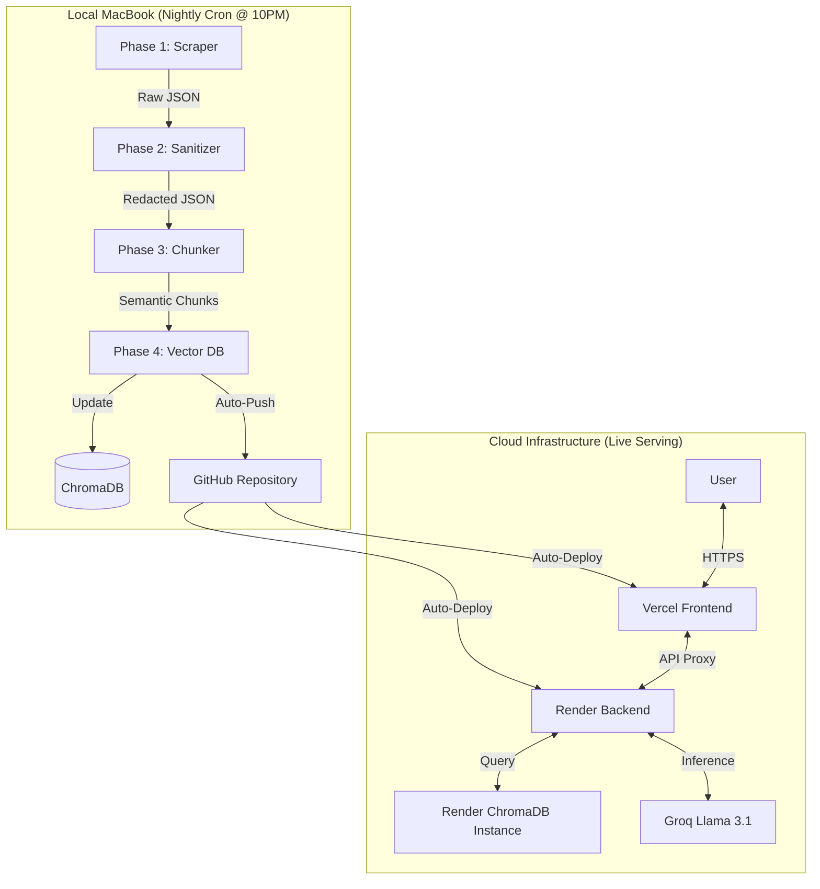

# 🚀 Groww Mutual Fund RAG Assistant

A production-grade **Retrieval-Augmented Generation (RAG)** system designed to provide hyper-accurate, real-time insights into Groww-specific Mutual Funds. The system automates data ingestion from Groww's live site, processes it with privacy-first sanitization, and serves it through a high-performance FastAPI/Next.js interface.

---

## 🏗 System Architecture & Workflow

The project is structured as a **7-Phase Distributed Pipeline** that separates heavy background data ingestion (MacBook Local) from lightweight query serving (Render/Vercel Cloud).

### Pipeline Visualization



### 📋 Detailed Execution Workflow

| Phase | Component | Input | output | Key Technology |
| :--- | :--- | :--- | :--- | :--- |
| **Phase 1** | `scraper` | Groww URLs | Raw Hydrated JSON | Playwright (Headless) |
| **Phase 2** | `sanitizer` | Raw JSON | PII-Redacted JSON | Python `re` (Regex) |
| **Phase 3** | `chunker` | Redacted JSON | Semantic Text Chunks | LangChain Recursive Splitter |
| **Phase 4** | `vector_db` | Text Chunks | ChromaDB (SQLite) | FastEmbed (BGE-Small) |
| **Phase 5** | `gateway` | User Query | Intent Guarded String | FastAPI / Pydantic |
| **Phase 6** | `retriever` | Sanitized Query | LLM Response | Groq / Llama 3.1 8B |
| **Phase 7** | `frontend` | User Action | Dashboard UI | Next.js 15 / Tailwind |

---

## 🛠 Tech Stack

- **Backend**: FastAPI (Python 3.11)
- **Frontend**: Next.js 15 (Tailwind CSS, App Router)
- **Vector DB**: ChromaDB (Local SQLite Persistence)
- **Embeddings**: FastEmbed (BGE-Small-EN-v1.5)
- **LLM**: Groq (Llama 3.1 8B / 70B)
- **Scraping**: Playwright (Headless Chromium)
- **Automation**: GitHub Actions + Unix `nohup` Daemon

---

## 🚀 Local Setup & Execution

### 1. Environment Configuration
Create a `.env` file in the root directory:
```bash
GROQ_API_KEY=your_key_here
BACKEND_URL=http://127.0.0.1:8000
```

### 2. Backend Setup
```bash
# Initialize virtual environment
python3 -m venv phase1/.venv
source phase1/.venv/bin/activate

# Install dependencies
pip install -r requirements.txt

# Start the background API
./start_backend.sh
```

### 3. Frontend Setup
```bash
cd phase7
npm install
npm run dev
```

### 4. Scheduler (Automation)
To run the nightly 10 PM sync in the background:
```bash
chmod +x start_scheduler.sh
./start_scheduler.sh
```

---

## 🛡 Security & Privacy
- **PII Scrubbing**: All data is passed through `sanitizer.py` before being saved, ensuring no PII persists in the Vector DB.
- **Intent Guard**: `intent_guard.py` blocks investment advice and prohibited keywords.
- **Zero-Trust**: Local database persistence ensures data never leaves your infrastructure except for LLM inference (which is anonymized).

---

## 📖 Detailed API Guide
For full details on request structures, JSON payloads, and internal communication, please refer to the [API Documentation](architecture/API_Documentation.md).
