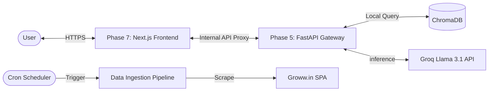

# 📖 Groww Mutual Fund RAG - API Documentation

This document provides a comprehensive end-to-end guide to the APIs used in the Groww Mutual Fund RAG system, covering internal microservices, frontend proxies, and external system integrations.

---

## 🏛 System API Architecture

The system follows a tiered architecture to ensure security, privacy, and high performance.



---

## 🔒 Authentication & Security

### 1. Environment-Based Secrets
The system uses environment variables for authentication. These must be defined in a `.env` file at the project root.

| Variable | Description | Security Level |
| :--- | :--- | :--- |
| `GROQ_API_KEY` | API Key for Groq Cloud (Llama 3.1 Inference). | **Critical** (Keep secret) |
| `BACKEND_URL` | URL of the Phase 5 FastAPI gateway. | Internal Configuration |

### 2. Internal Security: PII Sanitization
Every query and response is processed by `phase2/sanitizer.py` using high-performance regex patterns to redact:
- **PAN**: `[A-Z]{5}[0-9]{4}[A-Z]{1}`
- **Aadhaar**: `[0-9]{4}\s[0-9]{4}\s[0-9]{4}`
- **Email**: `[a-zA-Z0-9.-]+@[a-zA-Z0-9.-]+\.[a-zA-Z]{2,}`
- **Mobile**: `[6-9]\d{9}`

---

## 📡 Internal Serving API (FastAPI)

The core logic resides in a FastAPI microservice (Phase 5).

### 1. Chat & Retrieval
**Endpoint**: `POST /api/chat`  
**Description**: Accepts a user query, performs PII scrubbing, intent guarding, semantic retrieval from ChromaDB, and generates an LLM response.

#### Request Structure
```json
{
  "query": "What is the exit load for Groww Multicap Fund?",
  "selected_fund": "Groww Multicap Fund"
}
```
- `query` (String, Required): The user's question.
- `selected_fund` (String, Optional): Filters retrieval to a specific fund URL/context.

#### Response Structures

**Scenario A: Success (Allowed)**
```json
{
  "status": "allowed",
  "message": "Success",
  "answer": "The exit load for Groww Multicap Fund is 1% if redeemed within 30 days. No exit load applies after the specified period.",
  "sources": ["https://groww.in/mutual-funds/groww-multicap-fund-direct-growth"],
  "last_refreshed": "16 Mar 2026, 10:00 PM"
}
```

**Scenario B: Blocked (PII or Intent Guard)**
```json
{
  "status": "blocked",
  "message": "PII or Prohibited Intent Detected",
  "answer": "I'm sorry, but I cannot provide investment advice or process personal financial identifiers.",
  "last_refreshed": "16 Mar 2026, 10:00 PM"
}
```

#### Test with cURL
```bash
curl -X POST "http://127.0.0.1:8000/api/chat" \
     -H "Content-Type: application/json" \
     -d '{"query": "Hello", "selected_fund": null}'
```

---

### 2. System Status
**Endpoint**: `GET /api/status`  
**Description**: Returns the operational status of the backend and the last data sync timestamp.

#### Response Structure
```json
{
  "status": "online",
  "last_refreshed": "16 Mar 2026, 10:00 PM"
}
```

---

## 🌐 Frontend Proxy API (Next.js)

To prevent CORS issues and protect backend endpoints, the Next.js frontend (Phase 7) acts as a secure proxy.

### 1. Proxy Route: `/app/api/chat/route.ts`
- **Method**: `POST`
- **Action**: Forwards the JSON payload to `${BACKEND_URL}/api/chat`.
- **Error Handling**: Returns a 500 status if the Python backend is unreachable.

### 2. Proxy Route: `/app/api/status/route.ts`
- **Method**: `GET`
- **Action**: Polls the Python backend status and returns a cached/friendly message if offline.

---

## 🤖 External Integrations

### 1. Groq Cloud (LLM)
- **Model**: `llama-3.1-8b-instant`
- **Role**: Synthesizes a 3-sentence factual answer based on retrieved context.
- **Request Parameters**:
  - `temperature`: 0.0 (Deterministic)
  - `max_tokens`: 200
- **System Prompting**: Enforces strict "No Advice" and "Factual Only" rules.

### 2. Groww.in (Data Source)
- **Target**: `__NEXT_DATA__` JSON block within the SPA.
- **Extraction Method**: Playwright (Phase 1)
- **Data Points Collected**: NAV, AUM, Exit Load, Category, Expense Ratio, and Fund Manager details.

---

## 🛠 Troubleshooting APIs

- **Backend Offline?**: Check if `start_backend.sh` is running. Ensure port `8000` is open.
- **Empty Responses?**: Ensure Phase 4 (Vector DB) has completed its nightly run. Check `orchestrator/scheduler.log`.
- **API Key Errors?**: Verify `GROQ_API_KEY` is valid in your `.env` file.
