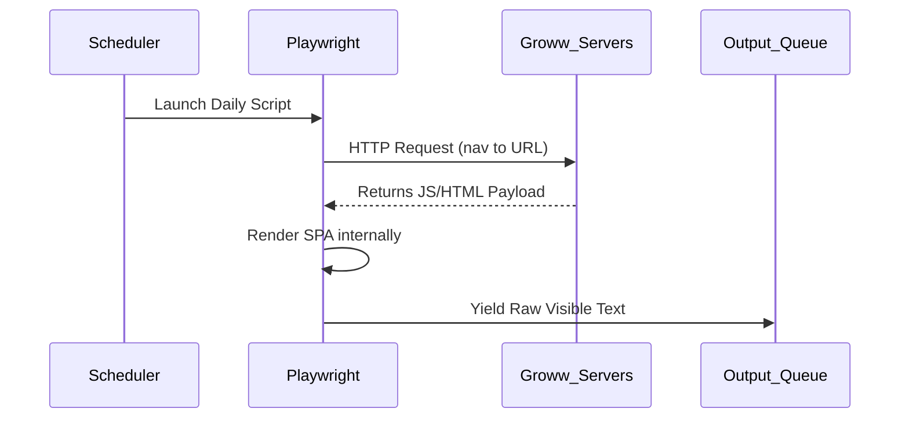
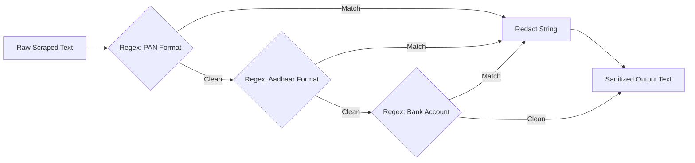
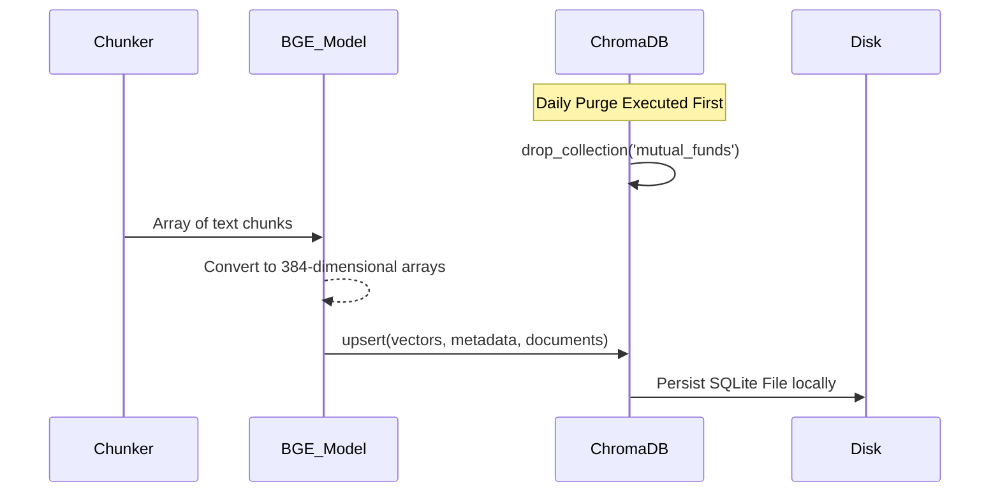
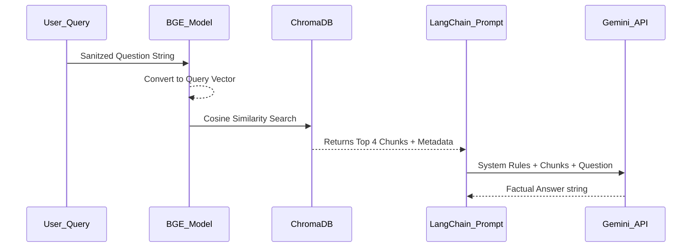
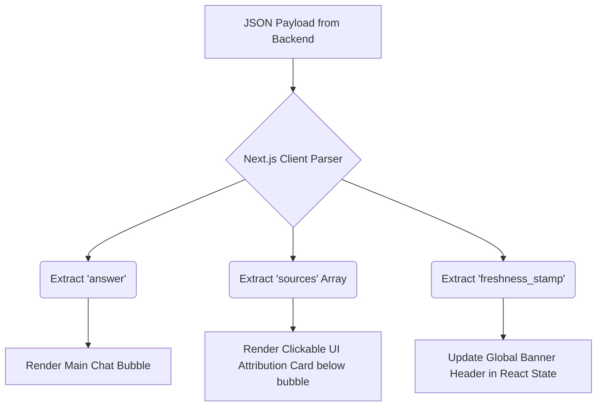

# Mutual Fund FAQ Assistant - Detailed System Architecture

This document describes the end-to-end architecture and system design for the RAG-based Mutual Fund FAQ Assistant. The architecture is broken down into highly granular phases to ensure exhaustive testing at every micro-step.

## Target Application Context
**Goal:** A purely factual Mutual Fund assistant that only answers based on 15-25 official URLs (zero hallucination).
**Core Rule:** Absolute refusal of financial advice, computations, or comparisons.

## Master System Architecture & Data Flow

This diagram illustrates the comprehensive end-to-end data lifecycle, linking every specific technology choices directly to the chronological phases of execution.

```mermaid
graph TD
    classDef trigger fill:#d32f2f,stroke:#fff,stroke-width:2px,color:#fff,font-weight:bold;
    classDef phase fill:#1e1e1e,stroke:#4caf50,stroke-width:3px,color:#fff;
    classDef tool fill:#1976d2,stroke:#fff,stroke-width:1px,color:#fff;
    classDef db fill:#f57c00,stroke:#fff,stroke-width:2px,color:#fff;
    classDef data fill:#388e3c,stroke:#fff,stroke-width:1px,color:#fff;
    classDef ui fill:#8e24aa,stroke:#fff,stroke-width:2px,color:#fff;

    %% --- PHASE 1 to 4: OFFLINE DATA PIPELINE ---
    subgraph DataIngestionPipeline [Daily Offline Pipeline]
        Trigger([Cron Scheduler]):::trigger -->|1. Triggers every 24h| Purge
        
        %% Phase 4 happens first chronologically during ingestion
        Purge{"Phase 4 DB Action: Drop Existing DB"}:::tool -->|2. Clears stale DB| Scraping
        
        %% Phase 1
        Scraping["Phase 1: Scraper Subsystem (Playwright)"]:::phase 
        GrowwURL["15-25 Official Groww URLs"]:::data -.->|Renders SPA JavaScript| Scraping
        Scraping -->|3. Outputs Raw Hydrated Text| Sanitization
        
        %% Phase 2
        Sanitization["Phase 2: Privacy Filter (Regex)"]:::phase
        Sanitization -->|4. Redacts PAN/Aadhaar/Acc Num| Chunking
        
        %% Phase 3
        Chunking["Phase 3: Text Processing (LangChain)"]:::phase
        Chunking -->|5. Chunks text and Appends Metadata| Vectorization
        
        %% Phase 4
        Vectorization["Phase 4: ML Embeddings (BGE)"]:::phase
        Vectorization -->|7. Converts text to 384D vectors| DBStore
        
        DBStore[("Local Vector Database (ChromaDB)")]:::db
    end

    %% --- PHASE 5 to 7: ONLINE QUERY PIPELINE ---
    subgraph OnlineQueryPipeline [Real-Time User Pipeline]
        %% Phase 7 Initiation
        UserQuery([User Types Question]):::ui -->|8. Interacts with frontend| NextJS["Phase 7: Frontend UI (Next.js)"]:::phase
        NextJS -->|9. POST api/chat| FastAPIGW["Phase 5: Backend API Gateway (FastAPI)"]:::phase
        
        %% Phase 5
        FastAPIGW -->|10. Exact same Phase 2 Regex Rules| QuerySanitizer["Phase 5: Query PII Scrub"]:::phase
        QuerySanitizer -->|11. Cleaned User String| Guardrail{"Phase 5: Intent Guardrail"}:::tool
        Guardrail -->|Yes: Prohibited Intent| HardcodeRefusal["Returns Hardcoded Error"]:::data
        HardcodeRefusal -->|Immediate Return| NextJS
        
        %% Phase 6
        Guardrail -->|No: Factual Intent| QueryEmbed["Phase 6: Embed Query Vector"]:::tool
        QueryEmbed -->|12. Query Vector sends search request| DBStore
        
        DBStore -->|13. Cosine Similarity Matching| RetrieveChunks["Phase 6: Retrieve Top 3-5 Chunks"]:::phase
        RetrieveChunks -->|14. Constructs highly strict system prompt| LLM
        
        LLM{"Phase 6: Generation (Groq / LLaMA 3.1)"}:::tool
        LLM -->|15. Forces max 3 sentences| JSONPayload["Output JSON payload"]:::data
        JSONPayload -->|17. Delivers payload to UI| NextJS
    end
```



---

## Phase 1: Web Scraping Engine
The foundational phase to acquire the raw data objectively without getting blocked by dynamic Single Page Applications (SPAs).

### 1.1 Objective of the Phase
To reliably automate the navigation to 15-25 specific Groww mutual fund URLs, wait for all JavaScript-rendered content (tables, paragraphs) to hydrate, and extract the raw, visible text.

### 1.2 Architecture of the Phase


### 1.3 Key Components and Strategy
*   **Automation Scheduler (Cron):** A Python script (`orchestrator/scheduler.py`) is rigidly armed to perpetually execute the entire end-to-end framework automatically at **10:00 PM** daily, explicitly gathering data after Indian markets close for guaranteed freshness.
*   **Headless Browser Engine:** Used to natively render the React/Next.js frontend of Groww via Playwright.
*   **Comprehensive Dehydration (JSON Scraping):** By intercepting the backend `__NEXT_DATA__` React payload via BeautifulSoup, the engine perfectly extracts metrics like **Exit Load** and **Fund Size** instantaneously instead of painfully parsing floating HTML tags.
*   **Regex Fallbacks:** Actively hunts for disjointed UI arrays such as the explicitly rendered **Cash Equivalent** composition to enforce total alignment with front-end pie charts, injecting the exact balance straight into the LLM context vectors.

### 1.4 Why X over Y?
| Evaluated Options | JS Rendering Valid? | Anti-Bot Evasion | Verdict |
| :--- | :--- | :--- | :--- |
| **Playwright (Python)** | **Native** | High (Modern architecture) | **Selected:** Groww is an SPA; basic scrapers fail to read the dynamic context. Playwright renders it perfectly and is highly reliable for cron jobs. |
| **BeautifulSoup4** | None | Low | **Rejected:** Cannot execute JavaScript; returns empty div skeletons on SPAs. |
| **Selenium** | Native | Moderate | **Rejected:** Slower execution speed and higher resource overhead compared to Playwright. |

### 1.5 Error Handling and Resilience
*(To be populated with exact code strategies and retry logic post-implementation)*
*   **Target:** Handle `TimeoutError` exceptions if Groww servers are slow.
*   **Target:** Implement exponential backoff for HTTP 403 (Forbidden) responses.

---

## Phase 2: Data Sanitization (Privacy Filter)
Securing the extracted text before it ever touches long-term storage or local embedding models.

### 2.1 Objective of the Phase
To enforce a zero-trust privacy model by actively identifying and redacting Personally Identifiable Information (PII) specific to the Indian financial context from the raw text stream.

### 2.2 Architecture of the Phase


### 2.3 Key Components and Strategy
*   **Pre-compiled Regular Expressions:** For maximum speed, regex patterns for Indian PAN (regex: `[A-Z]{5}[0-9]{4}[A-Z]{1}`), Aadhaar, and standard account numbers are compiled globally.
*   **In-Memory Sanitization:** The text is scrubbed purely in temporary RAM; no raw text is ever written to disk.

### 2.4 Why X over Y?
| Evaluated Options | Speed / Latency | Accuracy on Deterministic Formats | Verdict |
| :--- | :--- | :--- | :--- |
| **Regex Engine (`re`)** | **Ultra-Fast (Microseconds)** | 100% | **Selected:** PAN and Aadhaar are highly deterministic formats. Regex handles this instantly without compute overhead. |
| **Local NLP Model (e.g. Presidio)**| Slow (Seconds) | 95% | **Rejected:** NLP models are overkill for structured financial IDs and introduce unnecessary latency/resource costs. |

### 2.5 Error Handling and Resilience
*(To be populated post-implementation)*
*   **Target:** Ensure the regex engine fails open (if a pattern times out, reject the chunk rather than passing potentially unredacted text).

---

## Phase 3: Text Chunking and Metadata Tagging
Preparing the sanitized text so it is semantically optimal for the embedding model to read.

### 3.1 Objective of the Phase
To split large, sanitized documents into precise semantic blocks (chunks) that fit perfectly within the LLM's context window, while attaching audit trails ("Freshness Stamps") to each fragment.

### 3.2 Architecture of the Phase
```mermaid
graph TD
    A[Sanitized Text Doc] --> B[Recursive Character Text Splitter]
    B --> C[Chunk 1: 500 chars]
    B --> D[Chunk 2: 500 chars]
    B --> E[Chunk N: 500 chars]
    
    C --> F[Metadata Injector]
    D --> G[Metadata Injector]
    
    F -->|Dict: {url, timestamp}| H[Final Tagged Chunk]
    G -->|Dict: {url, timestamp}| H
```

### 3.3 Key Components and Strategy
*   **Recursive Splitting:** Splitting text primarily by double-newlines `\n\n` (paragraphs), then single newlines, then spaces, to avoid cutting sentences in half.
*   **Chunk Parameters:** 
    *   **Size:** Target ~500-1000 characters per chunk.
    *   **Overlap:** ~50-100 characters to preserve context bridging between paragraphs.
*   **Metadata:** Every single chunk dictionary is hardcoded with `source_url` and `scraped_at_timestamp`.

### 3.4 Why X over Y?
| Evaluated Options | Semantic Coherence | Configuration Control | Verdict |
| :--- | :--- | :--- | :--- |
| **Recursive Character Splitter (LangChain)** | **High** | Granular (Size + Overlap params) | **Selected:** Intelligently respects paragraph and sentence boundaries, ensuring chunks remain readable facts. |
| **Token-based Splitter (NLTK/Spacy)** | High | Moderate | **Rejected:** Over-engineered for simple factsheet text; requires installing heavy NLP dependencies. |
| **Simple String Slice (array slicing)** | None (Cuts words mid-sentence) | None | **Rejected:** Destroys semantic meaning, leading to bad search retrieval. |

### 3.5 Error Handling and Resilience
*(To be populated post-implementation)*
*   **Target:** Handle edge cases where a scraped document is smaller than the chunk size (ensure metadata is still applied correctly and not skipped).

---

## Phase 4: Vectorization and Local Storage
Converting the chunked text into searchable mathematics and persisting it locally.

### 4.1 Objective of the Phase
To embed the metadata-tagged chunks using an open-weights model and store them in a persistent, locally-managed Vector Database collection, preceded by a daily purge mechanic.

### 4.2 Architecture of the Phase


### 4.3 Key Components and Strategy
*   **Local Embedding Engine:** Utilizing HuggingFace's BGE algorithm natively via Python to avoid API costs or rate limits during the heavy daily ingestion cycle.
*   **Database Management:** ChromaDB is configured to save to a local `./db` path. The script explicitly deletes the existing collection *before* inserting new vectors to guarantee yesterday's data is completely eradicated.

### 4.4 Why X over Y?
**Vector Database Consideration:**
| Evaluated Options | Cloud API Required? | Local File Persistence | Verdict |
| :--- | :--- | :--- | :--- |
| **ChromaDB** | **No** | **Excellent (SQLite based)** | **Selected:** Incredibly lightweight, requires 0 setup, and persists data directly to a local folder, making it completely free. |
| **Pinecone** | Yes | None | **Rejected:** Relies heavily on cloud infrastructure and API keys; overkill for 25 documents. |

**Embeddings Consideration:**
| Evaluated Options | Dimensions | Speed | Benchmark Accuracy (MTEB) | Verdict |
| :--- | :--- | :--- | :--- | :--- |
| **HuggingFace BGE via FastEmbed (bge-small-en-v1.5)** | 384 | Ultra-Fast | **Top-tier for small models** | **Selected:** Runs the exact BGE model using ONNX mathematically rather than PyTorch, dropping the memory footprint from ~500MB+ to ~150MB to easily clear Render Free Tier 512MB RAM constraints while keeping perfect mathematical accuracy. |
| **HuggingFace BGE via PyTorch (sentence-transformers)** | 384 | Fast | Excellent | **Rejected:** PyTorch dependencies consistently triggered Render Out-of-Memory (OOM) 512MB limits during ChromaDB database initializations. |
| **OpenAI text-embedding-3-small** | 1536 | API Bound | Excellent | **Rejected:** incurs continuous costs for the daily ingestion cycle. |

### 4.5 Error Handling and Resilience
*(To be populated post-implementation)*
*   **Target:** Ensure the DB purge operation has atomicity (if the scrape fails midway, the database shouldn't be left empty—implementing a staging collection swap).

---

## Phase 5: Backend API & Intent Routing (Guardrails)
The gateway for user input, enforcing strict behavioral rules before hitting the database.

### 5.1 Objective of the Phase
Receive user queries via HTTP, apply the PII sanitization filter to the input, and robustly evaluate the intent to actively block any requests for financial advice or quantitative calculations.

### 5.2 Architecture of the Phase
```mermaid
graph TD
    A[Raw HTTP GET/POST] --> B[FastAPI Endpoint]
    B --> C(Apply PII Regex Scrub)
    C --> D{Intent Classifier Heuristics}
    
    D -->|Match: "Advice", "Best Fund", "Compare"| E[Terminate & Return Fixed Message]
    D -->|Match: "Exit Load", "Expense Ratio"| F[Pass cleanly to Retrieval Phase]
```

### 5.3 Key Components and Strategy
*   **Async Endpoint:** FastAPI endpoint `/api/chat` that accepts robust JSON payloads.
*   **Intent Heuristics Engine:** A fast, rule-based keyword/pattern match (or lightweight zero-shot classifier) that intercepts prohibited financial terminology (e.g., "should I invest", "compare returns", "CAGR calculation").

### 5.4 Why X over Y?
| Evaluated Options | Sync/Async Execution | Vercel Deployment Support | Verdict |
| :--- | :--- | :--- | :--- |
| **FastAPI** | **Native Async (Fast)** | **Native (Next.js rewrites)** | **Selected:** The modern standard for Python APIs. Fast execution is critical while waiting for LLM network requests. |
| **Flask** | Primarily Sync (Slower) | Moderate | **Rejected:** Synchronous blocking architecture can cause timeouts during semantic searches and generation. |

### 5.5 Execution Mechanics
*   **Security Priority:** Raw strings are scrubbed for PII (PAN, Aadhaar, Bank, Email, Mobile) *before* intent checking.
*   **Refusals via UI Blockers:** Guardrails dynamically trigger "Blocked" statuses, generating red-tinted UI elements.

---

## Phase 6: Semantic Retrieval & Synthesis (RAG)
Vectorizing the safe user query and commanding the core LLM to answer strictly from context.

### 6.1 Objective of the Phase
Convert the sanitized query to a vector, find the top matching chunks in ChromaDB, assemble the strict prompt, and cleanly generate the <=3 sentence response using the Gemini API.

### 6.2 Architecture of the Phase


### 6.3 Key Components and Strategy
*   **Symmetric Embeddings:** The exact same HuggingFace BGE model used in Phase 4 is used to vectorise the question.
*   **System Prompt Hardening:** The LangChain template defines immutable rules overriding default LLM behaviour (e.g., `"You are a strictly factual assistant. Your answers must be shorter than 3 sentences. If the context does not contain the answer, literally say 'I do not have this information'."`).

### 6.4 Why X over Y?
| Evaluated Options | Free Tier Speed | Instruction Adherence Focus | Verdict |
| :--- | :--- | :--- | :--- |
| **Groq (Llama 3.1 8B)** | **Ultra-Fast (Hardware LPU)** | **Very High** | **Selected:** The fastest open-source LLM inference API available (~0.3s generation), perfect for quick iterative RAG chats without keeping users waiting. |
| **Gemini 1.5 Flash** | Slower (Software based) | Very High | **Rejected:** Free tier was occasionally timing out or adding multi-second latency spikes in API. |

### 6.5 Performance Optimizations (Singletons)
*   **In-Memory Load:** Both the BGE embedding model and the ChromaDB client are loaded once at module startup as Python Singletons `_BGE_MODEL_INSTANCE` and `_CHROMA_CLIENT_INSTANCE`.
*   **Latency Drop:** This optimization completely eliminated the 8 to 12-second cold-boot loading times, ensuring retrieval latency is purely limited by API network calls.

---

## Phase 7: UI & Source Attribution Display
Presenting the verifiable data accurately and beautifully to the end-user.

### 7.1 Objective of the Phase
Build a responsive frontend chat interface using Next.js that clearly differentiates between the bot's factual answer, the underlying source links, and the global freshness timestamp.

### 7.2 Architecture of the Phase


### 7.3 Key Components and Strategy
*   **Component Modularity:** React components specifically designed for "Cards" so that URLs aren't just raw blue links, but professional-looking attribution boxes.
*   **Global Layout:** The Next.js `/app/layout.js` dictates that the "Freshness Stamp" is persistently visible at the top of the interface, satisfying the audit requirement instantly.

### 7.4 Why X over Y?
| Evaluated Options | Vercel Deployment Synergy | API Proxying | Verdict |
| :--- | :--- | :--- | :--- |
| **Next.js** | **Native Platform Match** | Built-in via `next.config.js` | **Selected:** The absolute best fit for a Vercel deployment, allowing the Python backend to sit seamlessly alongside the React frontend without CORS nightmares. |
| **Vite / Plain React** | Requires heavy manual configuration | Manual | **Rejected:** Doesn't support serverless API routes natively bridging Python and JS out-of-the-box like Next.js does on Vercel. |

### 7.5 Error Handling and Resilience
*(To be populated post-implementation)*
*   **Target:** Handle 500/504 Gateway errors seamlessly with a subtle UI toast if the backend Python script times out.
*   **Target:** Render graceful UI skeletons while the `fetch()` call is waiting for the LLM response.
